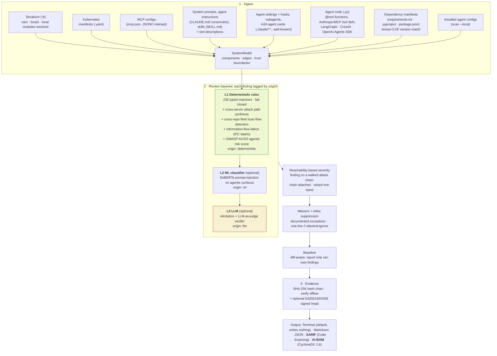
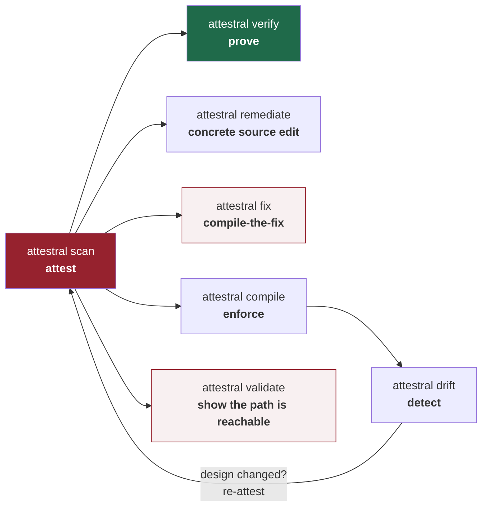
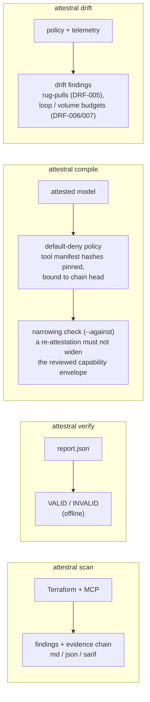
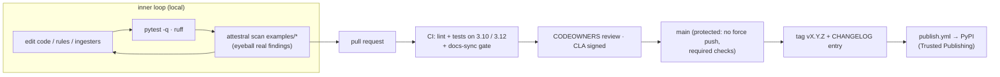

# Attestral

[](https://pypi.org/project/attestral/)
[](https://github.com/attestral-labs/attestral/actions/workflows/ci.yml)
[](https://pypi.org/project/attestral/)
[](LICENSE)

**The security scanner for AI agents and MCP servers.**

<p align="center">
  
</p>

<!-- RESEARCH POST: "We scanned N popular MCP servers" - link TBD -->

Your agent has a shell, a browser, your database, and a Slack token. Each tool is fine on its own. Together they are one injected sentence away from walking your secrets out the door. Attestral is the scanner that reads the *whole* picture.

It parses your MCP configs, agent instructions, system prompts, tool descriptions, and **agents defined in code** (LangGraph, CrewAI, the OpenAI Agents SDK, raw Anthropic/MCP tool definitions), builds a single **system model** of the fleet, and reviews the agentic surfaces every other scanner walks right past: prompt injection, tool poisoning, excessive agency, memory poisoning, and the **toxic flows** that only exist across servers. A shell tool and an egress tool are one injected sentence apart whether they were declared in `.mcp.json` or three `@tool` functions, and Attestral sees the flow either way. It models your cloud (Terraform) and Kubernetes in the *same* graph, so it sees the trust boundary between the agent and the infrastructure it can reach, not each in isolation.

Three layers, and every finding is labeled by which one found it: **deterministic rules** (always on, no eval, fails closed), an optional **local ML classifier** for injection text, and an optional **LLM-as-judge** to cut false positives. Every finding lands in a **tamper-evident SHA-256 evidence chain** you can hand an auditor and verify offline. No account, no server, no telemetry.

```bash
pip install attestral
attestral scan ./my-project
```

## Scan the MCP servers you've already installed

No repo needed. Audit the MCP servers your agent tools are already wired to:

```sh
attestral scan --local
```

Discovers and scans configs from Claude Code (user scope, project `.mcp.json`, and the current project's local scope inside `~/.claude.json`), Claude Desktop, Cursor, VS Code, and Windsurf. It reports which sources were found vs absent and how many servers each contributed, prints an inventory of the agent tool surface it reviewed, and runs everything through the same rule pipeline as a repo scan.

## Get started in one command

```sh
attestral init      # scaffold CI, pre-commit, and a waivers file into this repo
attestral scan .    # review the current project - prints straight to your terminal
```

`attestral init` writes three onboarding files, and **never overwrites anything that already exists** (existing files are skipped and reported):

| File | What it does |
|---|---|
| `.github/workflows/attestral.yml` | Gates every PR in CI and uploads findings to the Security tab. |
| `.pre-commit-config.yaml` | Runs attestral on every commit (see [pre-commit](#run-attestral-on-every-commit)). |
| `attestral-waivers.yaml` | Starter for documented, expiring exceptions. |

### Zero config: point it at a repo

No model file, no setup. `attestral scan .` autodiscovers the Terraform, the Kubernetes manifests, the `.mcp.json`, the agent instructions and A2A cards in a repo and reviews them in one graph. Every scan opens with what it found and, honestly, what it did not read, so a clean result reads as "clean", never "it didn't look":

```
Reviewed 6 components across 2 source files: 6 agent / MCP surface
Design review, not SAST: reads declared config and agent wiring, not arbitrary application logic.
```

### Terminal-first output

`attestral scan` prints a colour-coded, severity-grouped review straight to your terminal and **writes nothing to disk by default** - no more `attestral-report.*` files littering your repo. Ask for report files explicitly, with `-o` (a file stem) or `--format`:

```sh
attestral scan .                          # print only - nothing is written
attestral scan . -o review                # write review.md + review.json
attestral scan . --format sarif -o out    # write out.sarif for GitHub Code Scanning
attestral scan . --format aibom -o inv    # write inv.cdx.json - a CycloneDX 1.6 AI-BOM
attestral scan . --quiet --fail-on high   # CI: just the summary + gate line, exit 1 on high+
attestral scan . --baseline attestral-baseline.json   # first run records; later runs show only net-new
```

The AI-BOM is the inventory counterpart to the findings: every MCP server, subagent, A2A endpoint, and instruction surface in the scan as a CycloneDX 1.6 component or service - with pinned-package purls, capability classes, canonical manifest hashes, and the `authenticated` flag on remote endpoints - ready for the compliance and procurement workflows that consume SBOMs today.

`--quiet` drops the per-finding detail and prints only the summary and gate (nothing at all on a clean scan). Colour is emitted only to an interactive terminal and is suppressed under `NO_COLOR` or when the output is piped, so CI logs and pipes stay plain.

### Explain any rule

```sh
attestral explain ATL-103    # title, severity, description, fix, and framework refs
```

Every finding in the terminal output carries a `run: attestral explain <RULE_ID>` pointer, so the reasoning and the fix are one command away. Rule ids are matched case-insensitively.

## What it catches (236-rule pack)

| Area | Examples |
|---|---|
| **Agentic / MCP** (OWASP LLM Top 10, MCP research, 2026 CVEs) | shell-capable servers, broad filesystem roots, non-TLS transport, secrets in env, auto-installed packages (supply chain), mutable `@latest` tags (rug-pull), outbound-fetch/browser tools, auto-approved actions, unauthenticated remote servers, confused-deputy credential holders, known-CVE package versions (e.g. mcp-remote CVE-2025-6514), known-CVE versions in the agent's own dependency manifest (requirements.txt / pyproject / package.json, e.g. langchain-core "LangGrinch" CVE-2025-68664), hook config-injection in `.claude/settings.json` (CVE-2025-59536) |
| **Memory / context poisoning** (OWASP ASI06, agent-security SoK) | world-writable agent-instruction files (CLAUDE.md, `.cursorrules`, AGENTS.md) that anyone can rewrite to steer every future run; persistent memory / vector stores as memory-poisoning targets |
| **Agent skills** (SKILL.md) | packaged, auto-loaded skills that grant shell or wildcard tool access (excessive agency in a shareable artifact); skill text scored for injection like any instruction file |
| **ML layer** (`attestral[ml]`) | prompt-injection / jailbreak text in MCP tool & server descriptions, system prompts, and agent-instruction files |
| **AWS** (CIS-grounded) | public S3/RDS/Redshift, `0.0.0.0/0` security groups, wildcard IAM, unencrypted RDS/EBS/EFS/Neptune, disabled backups, KMS rotation off, public EC2/EKS, CloudTrail gaps, mutable ECR tags, plaintext ELB listeners |
| **Azure** (CIS-grounded) | public blob access, non-HTTPS storage, storage TLS < 1.2 and no infrastructure encryption, public SQL, wildcard NSG rules, Key Vault purge protection off / public network access, Postgres/MySQL SSL not enforced, Postgres flexible server public access, SQL database TDE off, App Service not HTTPS-only, VM password auth, AKS local accounts enabled |
| **GCP** (CIS-grounded) | `0.0.0.0/0` firewall rules, public Cloud SQL, SQL without SSL, public bucket IAM (`allUsers`), bucket uniform-access off, KMS keys without rotation, Compute cloud-platform scope / IP forwarding / non-Shielded VMs, GKE legacy ABAC, non-private nodes, non-Shielded nodes, client-cert auth |
| **Kubernetes** (CIS K8s) | privileged containers, privilege escalation, dangerous capabilities, run-as-root, host network/PID, hostPath mounts, missing resource limits, mutable image tags |
| **Cross-cutting / toxic flows** (fleet-level, only visible in a system model) | lethal-trifecta capability combos (private data + egress), the same flow as a formal **information-flow lattice property** (confidentiality/integrity labels, ATL-217) that *clears* when you apply the recommended mitigation (an egress allowlist or a human-approval gate) while the heuristic still fires, unsafe data flow (untrusted input → code execution, with named source/sink servers and taint edges), shell + network reach, cross-server tool shadowing (tool-name collisions, steering descriptions, server-identity conflicts), agent runtime and cloud sharing no declared boundary controls |

Every finding maps to NIST 800-53, ASVS, SOC 2, CIS (AWS/Azure/GCP/K8s), OWASP LLM/Agentic, and MITRE ATLAS references. The agentic checks are additionally mapped to the attack/risk taxonomy of the agent-security SoK (Kim et al. 2026) in [docs/agentic-threat-model.md](docs/agentic-threat-model.md).

**Recall you cannot self-grade.** The in-repo benchmark scores 116/116, but its labels come from our own fixtures. So we also measure against eight published 2025-2026 CVE advisories labelled from the advisory, not our output ([`evaluation/external-recall.md`](evaluation/external-recall.md)): that number is allowed to fall below 100% and does, with every miss itemised and a concrete path to close it.

## How a scan works (the pipeline)



| Layer | What it does | Reproducible? | Cost |
|---|---|---|---|
| **L1 Deterministic** | 236 typed matchers over the model, fail-closed (unknown matcher never matches), plus cross-server attack-path synthesis | Yes, fully | Free, offline |
| **L2 ML** (optional) | Scores agentic text surfaces (MCP tool/server descriptions, system prompts) for prompt injection / jailbreaks. Three tiers: zero-dep heuristic (default), ONNX (`attestral[onnx]`, model-grade, no torch), or DeBERTa (`attestral[ml]`) | Pinned model + revision | Free, offline after first cache |
| **L3 LLM** (optional) | Elicits novel design threats, and a judge cross-examines findings to cut false positives | Verdicts recorded in the chain | Your API key |

Every finding carries its `origin`, so the deterministic core is never silently mixed with model reasoning. That separation is what makes the review audit-grade.

**Severity you can defend.** When a finding's component sits on an attack chain the symbolic walk shows reachable (a way in, a way to run code, a way out), the finding carries that chain and is raised one severity band - never above the chain's own severity:

```
HIGH (3)
  ATL-107  MCP server grants outbound network or browser access  (mcp_server.web)
    path: internal chain: web -> ops -> web · this component: entry+impact · raised from medium
```

A raised HIGH ships with the entry → pivot → impact path that justifies it, so it is trusted rather than argued with. The inverse move is deliberately never made: a finding off every chain is not downgraded, because the absence of a modeled path is not evidence of safety.

## The sophistication layers (optional)

```bash
# ML prompt-injection scan of agentic text surfaces (MCP tool/server descriptions and
# system-prompt files). Hits are tagged origin: ml and flow into the same evidence chain.
# Three tiers, chosen with --ml-engine (or ATTESTRAL_ML_ENGINE); default is auto:
#   heuristic  zero-dependency, instant, ships in core  -> attestral scan --ml (no extra install)
#   onnx       model-grade DeBERTa via onnxruntime, no torch, ~276 MB   <- recommended
#   deberta    heaviest, fine-tunable, pulls torch (~700 MB+)
# `auto` precedence: onnx -> deberta -> heuristic. A missing extra is never an error.
attestral scan ./my-project --ml                          # zero-install heuristic tier
pip install "attestral[onnx]"                             # add the light, accurate ONNX tier
attestral scan ./my-project --ml --ml-engine onnx         # weights auto-download once, offline after
# custom or air-gapped model? run scripts/export_onnx.py, then set ATTESTRAL_ML_MODEL=/path
attestral scan ./my-project --ml --ml-threshold 0.7       # tune sensitivity

# LLM threat elicitation on top of the deterministic layer
export ANTHROPIC_API_KEY=...
attestral scan ./my-project --llm

# LLM-as-judge: cross-examine findings to cut false positives.
# Verdicts (confirmed / false_positive / needs_review) are recorded in the chain.
export ATTESTRAL_JUDGE_API_KEY=...                 # or reuse ANTHROPIC_API_KEY
attestral scan . --judge --judge-panel 3           # 3 judges vote per finding
attestral scan . --judge --judge-suppress          # auto-waive confident false positives, on the record
```

The judge never deletes a finding. A confident `false_positive` becomes a machine-generated waiver carrying the judge's reasoning: suppressed from the gate, but kept on the record.

Every finding also carries a static **confidence** (high / medium / low). Deterministic rules are high by contract - structural facts with zero false positives on the benign corpus - while the ML tier's confidence tracks its probability. `attestral scan --min-confidence high` keeps only that CI-safe set and reports what it dropped, so you can fail a build on the findings that cannot be wrong and leave the probabilistic ones for a human. For the individual false positive, a one-line `// attestral:ignore ATL-xxx reason: ...` marker in the config waives it in place (kept in the evidence chain, not hidden). The benign zero-FP promise is a gated test, not a claim; see [`docs/false-positive-budget.md`](docs/false-positive-budget.md).

### Tuning / training the ML layer

The ML layer ships pointed at a DeBERTa classifier already fine-tuned for prompt injection, so **start zero-shot** (`--ml`, no training). If you need to adapt it to your own surfaces, climb three tiers - use as-is, calibrate the `--ml-threshold` on your labeled data, then fine-tune only if a gap remains. A runnable recipe (fine-tune + threshold-calibration scripts, data format, and where to source training data) lives in [`training/`](training/README.md).

## Baseline and waivers

Real repos start with findings. A waiver accepts a known risk and keeps the gate green without hiding anything: the waived finding stays in the evidence chain with its justification, and becomes a SARIF suppression (GitHub shows it dismissed, not open).

```yaml
# attestral-waivers.yaml  (auto-discovered at the scan root)
waivers:
  - rule: ATL-005
    component: aws_db_instance.app     # or "*" for every component
    reason: Encryption enforced at the storage layer; tracked in SEC-1234.
    expires: 2026-12-31                # optional
```

Fail-safe: a waiver with no `reason` is ignored, and an expired waiver stops suppressing. A finding can only be silenced by a current, justified exception.

### Accepting a risk is itself an audit record

Prefer `attestral accept` over hand-editing the YAML - it writes the waiver with provenance and a content pin:

```bash
# one line, copied from the finding in the scan output
attestral accept . ATL-104 mcp_server.jira -r "Secrets rotated nightly; tracked in SEC-1234." --expires 2026-12-31
```

The recorded entry says **who** accepted the risk (your git identity), **when**, **why**, and **what** was accepted - a `finding_sha256` pin over the rule, component, severity, and reachable chain as they were at acceptance. The suppressed finding carries that provenance into the evidence chain, so an auditor reads "this engineer accepted this risk on this date with this justification" straight from the record.

The pin is what keeps the acceptance honest: if the risk itself changes - a rule wave re-rates the finding, or a new tool completes an attack chain through the component and reachability raises its severity - the pin stops matching, the scan reports the acceptance as stale, and the finding comes back until someone re-accepts the *current* risk. You accepted a medium; you did not accept the high it became.

## The flow that spans repos: `attestral fleet`

Agentic risk lives in the *integration*. A shell tool in one repo and an untrusted-input tool in another are each fine on their own; together they are an attack chain. No per-repo scanner can see that, because each repo is clean in isolation. `attestral fleet` models several repos as **one** system:

```bash
attestral fleet ./data-agent ./ops-agent ./notify-agent
```

```
Fleet: 3 repos
  data-agent    2 components · reach: network, saas_data
  ops-agent     1 components · reach: shell
  notify-agent  1 components · reach: messaging

cross-repo chain: entry [data-agent] -> pivot [ops-agent] -> impact [notify-agent]
```

It merges every repo into one graph (tagging each component with its repo), then runs the full review over the union. When the fleet's combined capabilities complete an attack chain that **no single repo completes alone**, it fires **ATL-213** and names which repo supplies the entry, the pivot, and the exfiltration. Reachability escalation follows: a medium finding in one repo is raised to high because *another* repo is what completes its chain. This is the one thing a single-file scanner structurally cannot answer, and it is the point of building a system model in the first place.

## Beyond findings: prove it, enforce it, verify it

A scanner stops at a list of findings. Attestral turns the reviewed design into a tamper-evident record and a runtime policy: the depth that makes the review audit-grade, and the reason it can't be trivially cloned. Attest the design, prove the record has not been altered, compile it into a default-deny runtime policy, and detect when what runs diverges from what was reviewed. The whole loop runs offline, on a laptop, free.

### Integrity, and now authenticity

The SHA-256 chain is **tamper-evident**: edit any past finding and every later hash, and the head, stop matching. On its own that proves the chain is internally consistent, not that it is the chain *you* sealed, an attacker could edit a finding, recompute the whole chain and a new head, and `verify` would still say VALID. `attestral sign` closes that with an **Ed25519 signature over the head, wrapped in a DSSE envelope** (the same envelope Sigstore and in-toto use). Now `attestral verify --public-key` checks both: integrity (no entry altered) *and* authenticity (this is the chain the key holder sealed, not a recomputed forgery). Signing needs the `attestral[sign]` extra; the integrity check still runs with zero dependencies.

### The loop in one picture



Two commands answer "so what do I do about this finding" from both ends. `attestral remediate` reads the rule's own matcher and the component's real value and prints the **concrete source edit** to make: the boolean flag to flip (`set publicly_accessible = false`), the bad value to replace (`http://… -> https://…`), the control to add, tied to the file it lives in. `attestral fix` compiles the exact **enforceable control** that closes the finding, bound to the review's chain head, with a verification verdict: a fleet finding is proven closed by re-synthesizing the model without the isolated capability (`re-synthesized`), and a per-server finding gets the mcp-guard constraint that governs it at the proxy (`enforced-at-proxy`). A remediation that is *also* an enforceable runtime control is the payoff of the attest-compile-drift loop, and the thing a linter structurally cannot offer.

### The four commands



```bash
# SCAN: review a project (Terraform + MCP configs discovered automatically)
attestral scan ./my-project --format both          # md + json
attestral scan . --fail-on high                    # CI gate: exit 1 on high/critical
attestral scan . --min-confidence high --fail-on high  # CI-safe set only: structural, 0-FP-on-benign
attestral scan . --format sarif -o attestral       # SARIF -> GitHub Security tab + PR annotations

# VERIFY: prove a report has not been altered (no network, no server)
attestral verify review.json

# SIGN: make the chain authentic, not just tamper-evident (Ed25519 / DSSE)
attestral sign --gen-key reviewer                       # one-time: a keypair
attestral sign review.json --key reviewer.key --signer "Ada L"
attestral verify review.json --public-key reviewer.pub  # checks integrity AND authenticity

# COMPILE: turn the attested design into a default-deny mcp-guard policy
attestral compile ./my-project -o policy.yaml
# and verify a later design still NARROWS the reviewed one (fails on an expansion)
attestral compile ./my-project --against policy.yaml

# DRIFT: diff runtime telemetry against the attested design
attestral drift policy.yaml events.jsonl --fail-on-drift

# VALIDATE: prove whether the assembled attack paths actually hold
# (tier 0: symbolic walk over the model's edges, no execution, no network)
attestral validate ./my-project
attestral validate ./my-project -o proof --fail-on-reachable   # write proof.md + chain, gate CI

# FLEET: model several repos as ONE agent fleet and find flows that span them
attestral fleet ./repo-a ./repo-b ./repo-c                 # ATL-213: cross-repo toxic flow
```

### Install and run the whole loop (60 seconds)

```bash
pip install attestral

attestral scan examples/demo-project -o review        # attest  -> review.md + review.json
attestral verify review.json                          # prove   -> chain VALID
attestral remediate examples/demo-project             # remediate -> concrete source edit per finding
attestral fix examples/demo-project                   # fix     -> enforceable control per finding
attestral compile examples/demo-project -o policy.yaml # enforce -> default-deny policy
attestral drift policy.yaml examples/demo-project/runtime-events.jsonl --fail-on-drift  # detect
```

## Real-world benchmark

Run on [TerraGoat](https://github.com/bridgecrewio/terragoat) (Bridgecrew's deliberately-vulnerable Terraform), same repo, as the rule pack grew (the pack is **236 rules** today; this table shows the historical progression, not the current pack size):

| | TerraGoat AWS | TerraGoat Azure | TerraGoat GCP | Distinct rules |
|---|---|---|---|---|
| v0.4.0 (10 rules) | 3 | - | - | 3 |
| v0.6.0 (57 rules) | 7 | 2 | 3 | 12 |
| v0.9.0 (169 rules) | **8** | **3** | **5** | **16** |

The pipeline (ingest, evidence chain, tamper detection, gate, SARIF) is verified on real code. One honest caveat: TerraGoat leans heavily on Terraform variables and modules, and Attestral's HCL resolver does not yet evaluate cross-variable interpolation, so a chunk of TerraGoat's misconfigurations sit behind `var.` references the scanner can't see through yet. The TerraGoat number is therefore a **floor** gated by HCL-resolution depth, not a measure of the 163-rule cloud pack's reach. Deeper HCL resolution is on the roadmap; when it lands, these numbers jump without adding a single rule.

## What it does not do

A tool you can trust is one that is honest about its edges. Attestral is a **design review, not a SAST tool**: it reads the declared surface (config, agent wiring, prompts, IaC) and reasons over the system model, but it does not read the inside of a tool's implementation, execute anything against your live agent, or prove exploitability (a reachable path is necessary, not sufficient). It has known blind spots too: HCL cross-variable resolution depth, coarse capability classification, a probabilistic ML tier, and agent-code ingestion that needs a recognizable framework. The full list, including where our own detection breaks under adaptive attack, is in [`docs/limitations.md`](docs/limitations.md). We would rather state the limits than imply coverage we do not have.

## Use it in CI

```yaml
# .github/workflows/attestral.yml
name: attestral
on: [pull_request]
permissions:
  contents: read
  security-events: write        # to upload to the Security tab
jobs:
  design-review:
    runs-on: ubuntu-latest
    steps:
      - uses: actions/checkout@v5
      - uses: actions/setup-python@v6
        with: { python-version: "3.12" }
      - run: pip install "attestral[terraform]"

      # Inline annotations on the offending line, via GitHub code scanning.
      - run: attestral scan . --format sarif -o attestral
      - uses: github/codeql-action/upload-sarif@v3
        with: { sarif_file: attestral.sarif }

      # A clean job summary rendering the reachable attack paths and the
      # findings this PR introduced (commit attestral-baseline.json first).
      - run: attestral scan . --baseline attestral-baseline.json --format md-summary -o attestral
      - run: cat attestral.summary.md >> "$GITHUB_STEP_SUMMARY"

      # Hard gate: fail only on net-new high/critical (auto-uses attestral-waivers.yaml).
      - run: attestral scan . --baseline attestral-baseline.json --fail-on high --quiet
```

The action does three things a passing check does not: SARIF puts each finding inline on the offending line, the job summary renders the reachable **entry → pivot → impact** path so a reviewer sees the story not a list, and `--baseline` gates on **net-new** findings only, so a brownfield repo adopts without failing on day-one debt. `attestral init` scaffolds exactly this; ready-made workflows also live in `examples/github-actions/`.

## Run attestral on every commit

```sh
pip install pre-commit
```

Add to `.pre-commit-config.yaml`:

```yaml
repos:
  - repo: https://github.com/attestral-labs/attestral
    rev: v0.17.0
    hooks:
      - id: attestral        # gate infra/agent config in this repo
      - id: attestral-local  # optional: audit installed MCP servers
```

Then `pre-commit install`. See `examples/pre-commit/` for details.

## Writing custom rules

Rules are YAML with structured matchers. No `eval` anywhere, and an unknown matcher fails closed (never matches).

```yaml
rules:
  - id: ORG-001
    title: Internal load balancer missing auth attribute
    severity: high
    target: aws_lb                     # component type prefix, or "model"
    match: { attr_missing: auth }
    description: ...
    recommendation: ...
    frameworks: ["NIST AC-3", "SOC2 CC6.1"]
```

```bash
python -c "from attestral.rules import RuleEngine; RuleEngine(['org_rules.yaml'])"
```

## Development

```bash
pip install -e ".[dev,terraform,llm]"   # add ,ml for the DeBERTa layer (pulls torch)
pytest -q                 # offline suite; the live judge test skips without a key
ruff check attestral tests
```

To run the live judge test, set `ATTESTRAL_JUDGE_API_KEY` (or `ANTHROPIC_API_KEY`) and re-run `pytest -q`.

### How a change ships



The **docs-sync gate** (`tests/test_docs_sync.py`) keeps this README honest: it
fails when a pipeline module exists that no diagram shows, when a CLI command
is undocumented, or when the package version has no `CHANGELOG.md` entry. If
you add a stage, draw it - the suite won't pass until you do.

## License

Apache 2.0.
